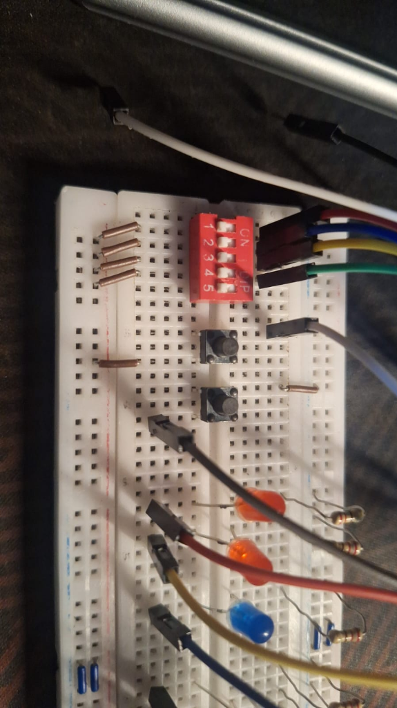

# Evidencias de Funcionamiento — Reto 14
## Procesador de Verificación en FPGA Sipeed Tang Primer 25K

- **Estudiante:** Urik Camilo Valenzuela Flynn
- **Matrícula:** 20250469
- **Asignatura:** Sistemas Digitales con FPGA (ITLA)
- **Docente:** Prof. Wilkins Gabriel Cedano Del Rosario

---

### 1. Enlace a Video Demostrativo
- **Plataforma:** YouTube
- **Enlace:** [https://youtu.be/Fu_dqSa0cHM](https://youtu.be/Fu_dqSa0cHM)
- **Descripción:** Demostración del funcionamiento en tiempo real sobre la tarjeta Tang Primer 25K montada en protoboard, verificando:
  1. Estado inicial tras reset mediante switch/pulsador `btn_rst_n`.
  2. Operación **SUMA** (`{v, u} = 01`) con acarreo en `led_flag`.
  3. Operación **RESTA** (`{v, u} = 11`) con préstamo en `led_flag`.
  4. Operación **MAYOR** (`{v, u} = 10`) con bandera de igualdad en `led_flag`.
  5. Operación **XOR** (`{v, u} = 00`) con paridad impar en `led_flag`.
  6. Función del habilitador `btn_en` congelando y actualizando el registro de salida $Q[3:0]$.
  7. Comprobación de prioridad del reset asíncrono sobre la señal de enable.

---

### 2. Registro Fotográfico del Montaje
- **Montaje físico de la tarjeta Tang Primer 25K y protoboard con conexionado de switches, botones y LEDs:**
  - Archivo: `evidencias/foto_placa_montaje.png`
  

